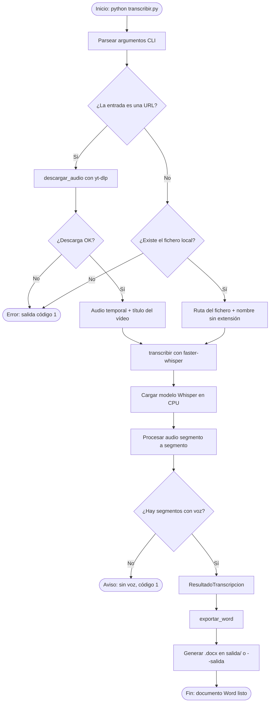
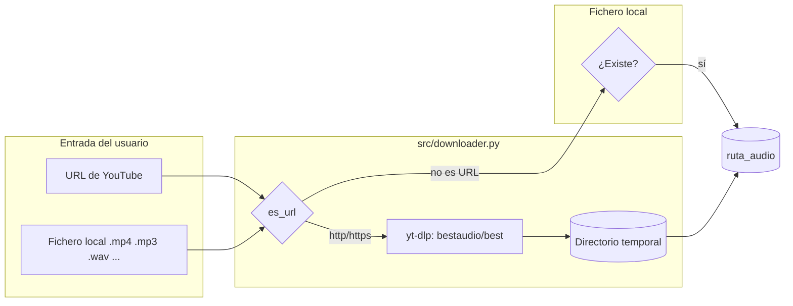
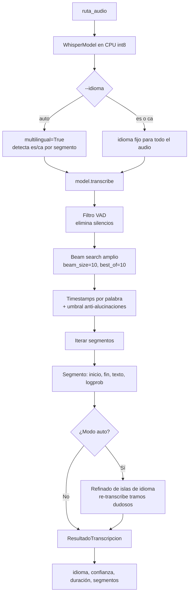
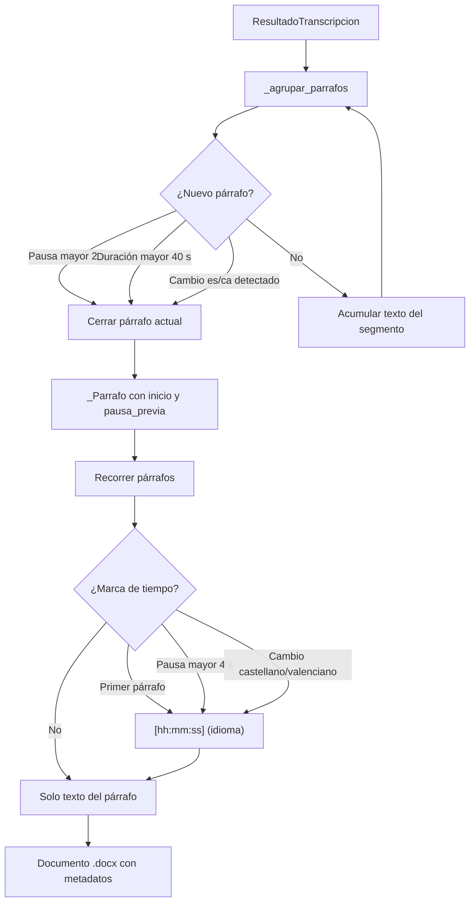

# Transcriptor Whisper local

Herramienta de línea de comandos para Windows que transcribe ficheros de audio/vídeo o enlaces de YouTube a un documento Word (`.docx`), usando [faster-whisper](https://github.com/SYSTRAN/faster-whisper) en CPU. Soporta español (`es`) y catalán/valenciano (`ca`).

En modo automático (por defecto) el idioma se detecta **en cada segmento del audio**, por lo que funciona con grabaciones donde los oradores alternan castellano y valenciano (por ejemplo, plenos municipales): cada intervención se transcribe en el idioma en que se pronunció. La configuración prioriza la fidelidad de la transcripción sobre la velocidad.

Además, tras la transcripción se aplica una **segunda pasada de refinado de idioma**: como el castellano y el valenciano son muy parecidos, a veces Whisper detecta mal el idioma de una ventana de ~30 s y "traduce" el audio al idioma equivocado en lugar de transcribirlo literalmente. El refinado localiza esos tramos sospechosos (tramos cortos en un idioma rodeados por el otro), los re-transcribe forzando el idioma del contexto y conserva la versión que mejor encaja con el audio. Los cambios de idioma reales del orador se respetan.

## Requisitos

- Windows 10/11
- Python 3.11
- FFmpeg instalado y en el PATH (`ffmpeg -version` debe funcionar)

## Instalación

```powershell
py -3.11 -m venv .venv
.\.venv\Scripts\Activate.ps1
pip install -r requirements.txt
```

## Uso

```powershell
# Fichero local de vídeo o audio, forzando español
python transcribir.py "C:\videos\charla.mp4" --idioma es

# Vídeo de YouTube en catalán/valenciano con modelo medium
python transcribir.py "https://www.youtube.com/watch?v=XXXX" --idioma ca --modelo medium

# Con ruta de salida concreta
python transcribir.py entrada.mp3 --salida "C:\docs\resultado.docx"
```

### Parámetros


| Parámetro  | Valores                                       | Por defecto            | Descripción                                                                                              |
| ---------- | --------------------------------------------- | ---------------------- | -------------------------------------------------------------------------------------------------------- |
| `entrada`  | ruta o URL                                    | (obligatorio)          | Fichero de audio/vídeo o enlace de YouTube                                                               |
| `--idioma` | `es`, `ca`, `auto`                            | `auto`                 | `auto` detecta el idioma en cada segmento (audios mixtos es/ca); `es`/`ca` lo fuerzan para todo el audio |
| `--modelo` | `tiny`, `base`, `small`, `medium`, `large-v3` | `large-v3`             | Modelo Whisper a usar                                                                                    |
| `--salida` | ruta `.docx`                                  | `salida\<nombre>.docx` | Documento Word de salida                                                                                 |


El documento sale en párrafos limpios, pensado para revisión humana. Solo se inserta una marca `[hh:mm:ss] (idioma)` cuando se detecta un posible cambio de interlocutor (pausa larga) o un cambio de idioma castellano/valenciano, para que el revisor pueda localizar ese punto en la grabación.

## Modelos y rendimiento en CPU

El modelo se descarga automáticamente la primera vez (caché de Hugging Face, `%USERPROFILE%\.cache\huggingface`).


| Modelo     | Descarga | RAM aprox. | Velocidad CPU (orientativa) | Calidad                          |
| ---------- | -------- | ---------- | --------------------------- | -------------------------------- |
| `tiny`     | ~75 MB   | ~1 GB      | ~10x tiempo real            | Baja                             |
| `base`     | ~145 MB  | ~1 GB      | ~7x tiempo real             | Baja-media                       |
| `small`    | ~460 MB  | ~2 GB      | ~4x tiempo real             | Media (bien para `es`)           |
| `medium`   | ~1.5 GB  | ~4 GB      | ~1.5x tiempo real           | Alta                             |
| `large-v3` | ~3 GB    | ~6 GB      | ~0.5x tiempo real           | Muy alta (recomendado para `ca`) |


"4x tiempo real" significa que 1 hora de audio tarda ~15 minutos. Los tiempos reales dependen de la CPU. La configuración actual (beam search amplio + timestamps por palabra) es más lenta que esos valores orientativos, a cambio de mayor fidelidad.

Para catalán/valenciano los modelos pequeños cometen bastantes errores; por eso el modelo por defecto es `large-v3`. Si necesitas una pasada rápida de borrador, usa `--modelo small`.

## Estructura

```
Whisper/
  transcribir.py        # punto de entrada CLI
  src/
    downloader.py       # descarga audio de YouTube con yt-dlp
    transcriber.py      # transcripción con faster-whisper + refinado de idioma
    idioma.py           # detección heurística castellano/valenciano sobre texto
    exporter.py         # generación del .docx
  docs/
    ARQUITECTURA.md     # documentación técnica detallada
  salida/               # documentos generados (por defecto)
```

Para diagramas de secuencia entre módulos, modelo de datos, ciclo de vida de ficheros y decisiones de diseño, consulta [docs/ARQUITECTURA.md](docs/ARQUITECTURA.md).

## Flujograma del funcionamiento

### Flujo general (de la entrada al documento Word)




### Resolución de la entrada




### Pipeline de transcripción




### Generación del documento Word




## Arquitectura y módulos


| Módulo               | Responsabilidad                                     | Entrada                         | Salida                   |
| -------------------- | --------------------------------------------------- | ------------------------------- | ------------------------ |
| `transcribir.py`     | Orquesta el flujo completo, CLI y manejo de errores | Argumentos de línea de comandos | Código de salida 0/1     |
| `src/downloader.py`  | Descarga la pista de audio de YouTube               | URL                             | `(ruta_audio, título)`   |
| `src/transcriber.py` | Transcripción con faster-whisper                    | Ruta de audio, modelo, idioma   | `ResultadoTranscripcion` |
| `src/exporter.py`    | Formatea y exporta a Word                           | `ResultadoTranscripcion`        | Fichero `.docx`          |


### Modelo de datos

La transcripción devuelve un `ResultadoTranscripcion` con:

- `idioma` y `probabilidad_idioma`: idioma detectado globalmente (o inicial en modo `auto`)
- `duracion`: duración total del audio en segundos
- `multilingue`: `True` si se usó detección automática por segmento
- `tramos_refinados`: número de tramos corregidos por el refinado de idioma
- `segmentos`: lista de `Segmento(inicio, fin, texto, logprob)` con timestamps en segundos

### Decisiones de diseño

1. **Detección multilingüe por segmento** (`--idioma auto`): pensado para plenos y grabaciones donde alternan castellano y valenciano. Whisper re-detecta el idioma en cada ventana de audio.
2. **Refinado de islas de idioma** (solo en modo `auto`): Whisper decide el idioma de cada ventana de ~30 s sin margen de seguridad; si confunde valenciano con castellano (o viceversa), genera el texto "traducido" al idioma equivocado. La segunda pasada busca tramos cortos (≤ 2 min) cuyo texto salió en un idioma distinto al de los tramos vecinos, los re-transcribe forzando el idioma del contexto y se queda con la versión de mayor log-probabilidad media (la que mejor encaja con el audio). Así se corrigen las confusiones sin alterar los cambios de idioma reales.
3. **Prioridad a la fidelidad**: beam search amplio, timestamps por palabra y filtro de alucinaciones en silencios largos. Más lento, pero más preciso.
4. **Directorio temporal**: los audios de YouTube se descargan en una carpeta temporal que se borra al terminar; solo persiste el `.docx`.
5. **Marcas mínimas en el Word**: el texto va en párrafos limpios. Solo se insertan marcas `[hh:mm:ss]` ante cambios de interlocutor (pausa larga) o cambio de idioma, para facilitar la revisión humana.
6. **Clasificación es/ca en la exportación**: el exportador analiza palabras inequívocas de cada idioma (`src/idioma.py`) para agrupar párrafos y etiquetar cambios de idioma, independientemente de lo que Whisper detectó internamente.

### Dependencias externas


| Dependencia                                                 | Uso                                                                   |
| ----------------------------------------------------------- | --------------------------------------------------------------------- |
| [faster-whisper](https://github.com/SYSTRAN/faster-whisper) | Motor de transcripción (modelos en caché de Hugging Face)             |
| [yt-dlp](https://github.com/yt-dlp/yt-dlp)                  | Descarga de audio desde YouTube                                       |
| [python-docx](https://python-docx.readthedocs.io/)          | Generación del documento Word                                         |
| FFmpeg (sistema)                                            | Decodificación de audio/vídeo (requerido por faster-whisper y yt-dlp) |


