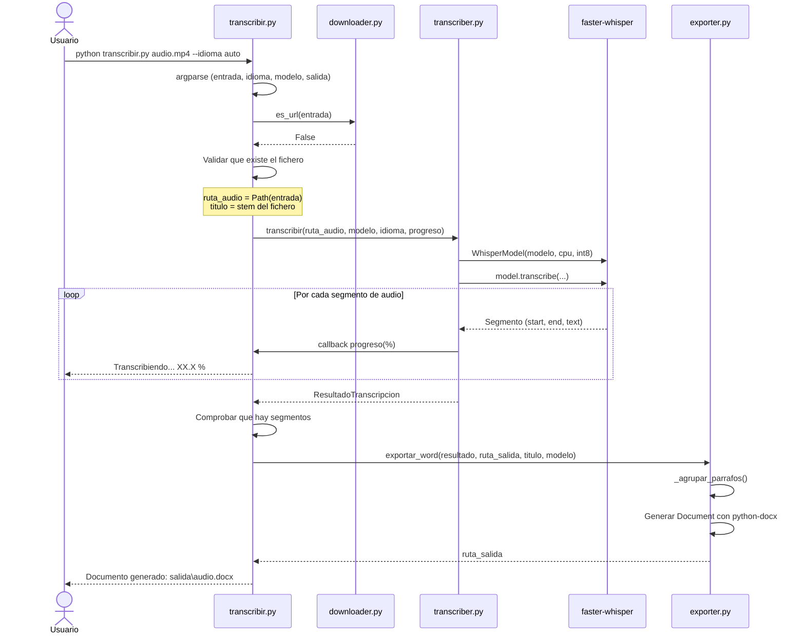
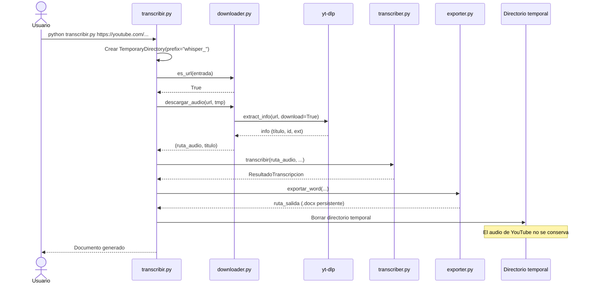
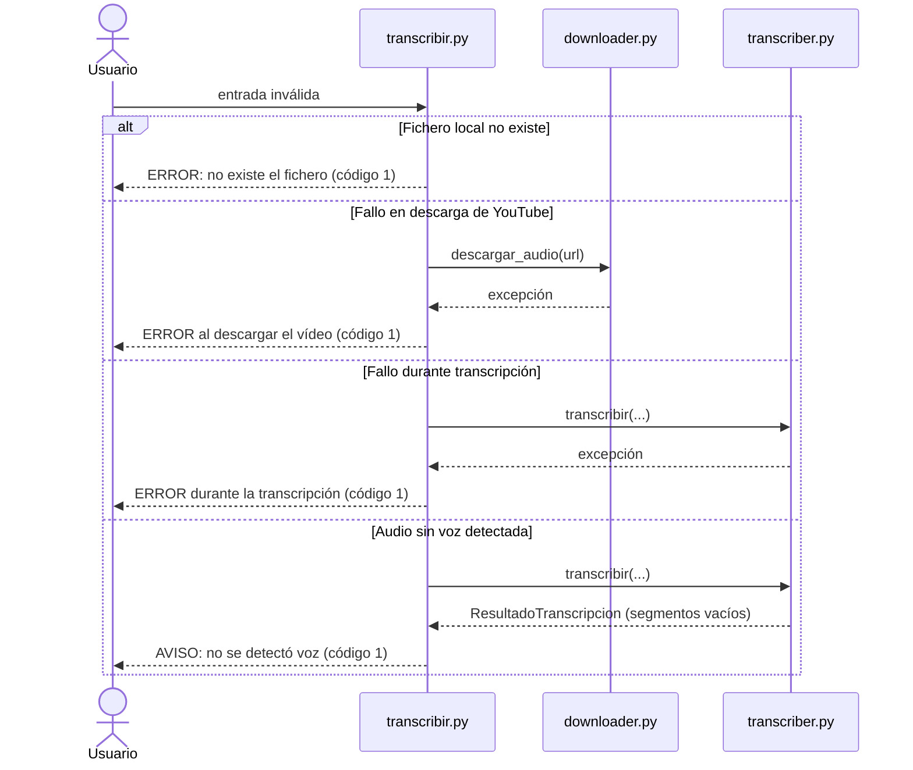
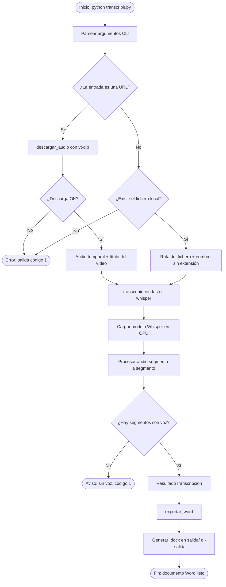
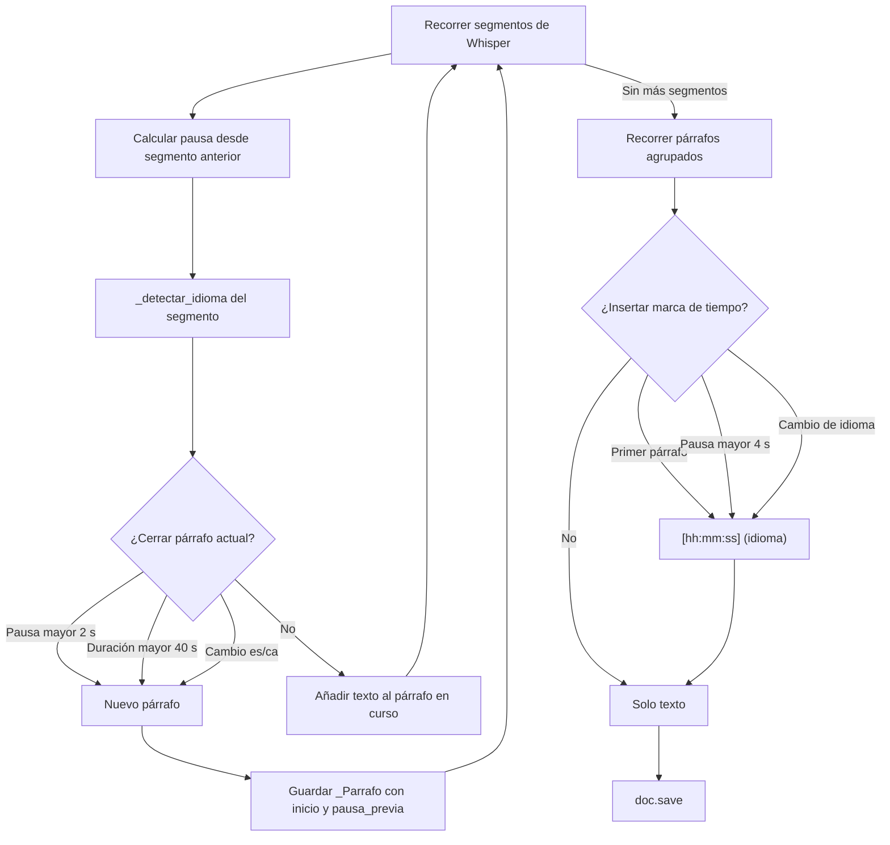

# Arquitectura del transcriptor Whisper

Documentación técnica del flujo de datos, los módulos y las decisiones de diseño del proyecto.

## Visión general

El proyecto es una aplicación de línea de comandos con tres etapas secuenciales:

1. **Adquisición** — resolver la entrada (fichero local o descarga de YouTube).
2. **Transcripción** — convertir audio en segmentos de texto con timestamps.
3. **Exportación** — formatear los segmentos en un documento Word legible.

No hay servidor, base de datos ni interfaz gráfica. Todo el procesamiento ocurre en el proceso del usuario, en CPU.

```
┌─────────────┐     ┌──────────────┐     ┌─────────────┐     ┌──────────────┐
│   Usuario   │────▶│ transcribir  │────▶│ faster-     │────▶│  python-docx │
│  (CLI)      │     │    .py       │     │  whisper    │     │   (.docx)    │
└─────────────┘     └──────┬───────┘     └─────────────┘     └──────────────┘
                           │
                    ┌──────┴───────┐
                    │   yt-dlp     │  (solo si la entrada es URL)
                    └──────────────┘
```

## Diagrama de secuencia entre módulos

### Caso feliz: fichero local



### Caso feliz: URL de YouTube



### Casos de error



## Módulos

### `transcribir.py` — orquestador

Punto de entrada único. Responsabilidades:

- Definir y parsear argumentos CLI (`entrada`, `--idioma`, `--modelo`, `--salida`).
- Crear un directorio temporal (`tempfile.TemporaryDirectory`) para audios de YouTube.
- Coordinar las tres fases: adquisición → transcripción → exportación.
- Mostrar progreso en consola y tiempos de ejecución.
- Normalizar la ruta de salida (siempre `.docx`, nombre seguro para Windows).
- Devolver código de salida `0` (éxito) o `1` (error).

Funciones auxiliares:

| Función | Descripción |
|---------|-------------|
| `_nombre_seguro(texto)` | Sustituye caracteres prohibidos en Windows (`<>:"/\|?*`) por `_` |

### `src/downloader.py` — adquisición desde YouTube

| Función | Entrada | Salida |
|---------|---------|--------|
| `es_url(entrada)` | `str` | `bool` — `True` si empieza por `http://`, `https://` o `www.` |
| `descargar_audio(url, directorio)` | URL + `Path` destino | `(Path, str)` — ruta del audio y título del vídeo |

Opciones de yt-dlp relevantes:

- `format: bestaudio/best` — mejor pista de audio disponible.
- `noplaylist: True` — solo el vídeo, no listas de reproducción.
- `outtmpl: %(id)s.%(ext)s` — nombre predecible en el directorio temporal.

### `src/transcriber.py` — motor de transcripción

#### Modelo de datos

```python
@dataclass
class Segmento:
    inicio: float   # segundos desde el inicio del audio
    fin: float
    texto: str
    logprob: float  # log-probabilidad media (confianza de Whisper en el texto)

@dataclass
class ResultadoTranscripcion:
    idioma: str
    probabilidad_idioma: float
    duracion: float
    multilingue: bool
    tramos_refinados: int   # tramos corregidos por el refinado de idioma
    segmentos: list[Segmento]
```

#### Parámetros de Whisper

| Parámetro | Valor | Motivo |
|-----------|-------|--------|
| `device` | `"cpu"` | Sin dependencia de GPU |
| `compute_type` | `"int8"` | Menor uso de RAM en CPU |
| `multilingual` | `True` si `--idioma auto` | Re-detecta idioma por ventana (es/ca mixto) |
| `condition_on_previous_text` | `False` | Evita arrastre de idioma entre oradores |
| `beam_size` / `best_of` | `10` / `10` | Mayor fidelidad, más lento |
| `word_timestamps` | `True` | Timestamps precisos por palabra |
| `hallucination_silence_threshold` | `2.0` | Descarta texto alucinado en silencios |
| `vad_filter` | `True` | Filtra tramos sin voz antes de transcribir |

Modelos válidos: `tiny`, `base`, `small`, `medium`, `large-v3`.

#### Refinado de islas de idioma (solo modo `auto`)

Con `multilingual=True`, Whisper decide el idioma de cada ventana de ~30 s
quedándose con el más probable, sin margen de seguridad. Como castellano y
valenciano son muy parecidos, a veces se equivoca; y cuando se equivoca no
transcribe literalmente, sino que **genera el texto "traducido" al idioma
detectado** (el token de idioma condiciona toda la salida).

Tras la transcripción, `_refinar_islas` aplica una segunda pasada:

1. Detecta el idioma del texto de cada segmento (`src/idioma.py`) y agrupa
   segmentos consecutivos por idioma.
2. Busca "islas": tramos de hasta `DURACION_MAX_ISLA` (120 s) cuyo idioma
   difiere del de los tramos vecinos por ambos lados.
3. Re-transcribe cada isla forzando el idioma del contexto.
4. Compara la log-probabilidad media ponderada por duración de ambas
   versiones y conserva la que mejor encaja con el audio. Si el cambio de
   idioma era real (el orador cambió de verdad), la versión forzada encaja
   peor y se mantiene la original.

### `src/idioma.py` — detección de idioma sobre texto

Clasifica un texto como `es`/`ca` contando palabras inequívocas de cada idioma
(`_PALABRAS_ES`, `_PALABRAS_CA`) y los apóstrofos típicos del catalán (`l'`,
`d'`, etc.). Devuelve `None` si no hay evidencia suficiente. Lo usan tanto el
refinado del transcriptor como el exportador.

### `src/exporter.py` — generación del Word

#### Constantes de formateo

| Constante | Valor | Efecto |
|-----------|-------|--------|
| `PAUSA_NUEVO_PARRAFO` | 2.0 s | Inicia párrafo nuevo tras pausa natural |
| `PAUSA_CAMBIO_INTERLOCUTOR` | 4.0 s | Inserta marca `[hh:mm:ss]` (posible cambio de orador) |
| `DURACION_MAX_PARRAFO` | 40.0 s | Trocea discursos largos sin pausas |

#### Detección de idioma en el exportador

Independiente de Whisper: usa `detectar_idioma` de `src/idioma.py` sobre el texto transcrito.

Se usa para:

1. Separar párrafos cuando cambia el idioma del texto.
2. Etiquetar marcas de tiempo con `(castellano)` o `(valenciano)`.

#### Estructura del documento generado

```
[Título del audio/vídeo]                    ← heading nivel 0
  Fecha, idioma, duración, modelo           ← metadatos (9 pt)
Transcripción                               ← heading nivel 1
  [00:00:00] (castellano)                   ← marca (negrita, 9 pt)
  Párrafo de texto limpio...
  [00:04:32] (valenciano)
  Otro párrafo...
```

## Flujogramas detallados

### Flujo general



### Agrupación de párrafos en la exportación



## Ciclo de vida de los ficheros

| Fichero | Ubicación | Persiste tras ejecutar |
|---------|-----------|------------------------|
| Audio de YouTube | `%TEMP%\whisper_*\` | No — se borra al salir del `with` |
| Audio local | Ruta original del usuario | Sí — no se modifica |
| Modelo Whisper | `%USERPROFILE%\.cache\huggingface` | Sí — caché entre ejecuciones |
| Documento Word | `salida\<nombre>.docx` o `--salida` | Sí — resultado final |

## Decisiones de diseño

### 1. Detección multilingüe por segmento

Los plenos municipales suelen alternar castellano y valenciano. Con `--idioma auto`, Whisper activa `multilingual=True` y re-detecta el idioma en cada ventana de audio, en lugar de fijar uno solo al inicio. Como la detección por ventana puede confundir es/ca, después se aplica el refinado de islas de idioma descrito en la sección de `src/transcriber.py`.

### 2. Fidelidad sobre velocidad

La configuración de beam search (`beam_size=10`, `best_of=10`) y timestamps por palabra multiplica el tiempo de procesamiento respecto a valores por defecto, pero reduce errores y alucinaciones en grabaciones largas.

### 3. Sin condicionamiento al texto previo

`condition_on_previous_text=False` evita que el idioma o el estilo del orador anterior influya en el segmento siguiente, algo crítico en sesiones con varios ponentes.

### 4. Marcas mínimas en el Word

El objetivo es un documento listo para revisión humana, no una transcripción cruda con timestamp en cada frase. Las marcas `[hh:mm:ss]` solo aparecen donde aportan valor: inicio, cambio de idioma o posible cambio de interlocutor.

### 5. Clasificación es/ca en dos capas

- **Whisper** decide en qué idioma transcribir cada ventana de audio.
- **El exportador** clasifica el texto resultante por léxico para agrupar párrafos y etiquetar cambios visibles en el documento.

Esto permite que el documento refleje cambios de idioma aunque Whisper ya haya transcrito correctamente, y separa párrafos mixtos para facilitar la corrección.

## Dependencias

```
transcribir.py
├── src.downloader
│   └── yt-dlp ──▶ FFmpeg (sistema)
├── src.transcriber
│   └── faster-whisper ──▶ FFmpeg (sistema)
│                        └── huggingface_hub (descarga de modelos)
└── src.exporter
    ├── python-docx
    └── src.transcriber (tipos de datos)
```

| Paquete | Versión mínima | Rol |
|---------|----------------|-----|
| `faster-whisper` | 1.0.0 | Transcripción local en CPU |
| `yt-dlp` | 2025.1.1 | Descarga de audio de YouTube |
| `python-docx` | 1.1.0 | Generación de documentos Word |
| FFmpeg | Sistema (PATH) | Decodificación de contenedores de audio/vídeo |

## Extensión futura (puntos de enganche)

Si se quisiera ampliar el proyecto, los puntos naturales de extensión son:

| Punto | Cambio posible |
|-------|----------------|
| `downloader.py` | Soporte para otras plataformas (Vimeo, archivos en la nube) |
| `transcriber.py` | GPU (`device="cuda"`), otros idiomas, diarización de hablantes |
| `exporter.py` | Salida en PDF, SRT/VTT con subtítulos, plantillas Word |
| `transcribir.py` | Interfaz web, procesamiento por lotes, cola de trabajos |
